# Live Code PCV

Repositori ini berisi tugas live code untuk mata kuliah Pengolahan Citra dan Video (PCV).

## Daftar File

* **1-Intro.py**: Operasi dasar OpenCV, membaca gambar, dan filter warna pada gambar serta video.
* **2-ti-eq.py**: Penerapan transformasi intensitas dan ekualisasi histogram secara manual tanpa fungsi bawaan.
* **3-filter-spasial.py**: Penerapan berbagai macam filter spasial (lowpass, highpass, deteksi tepi) pada gambar.

---

## Dokumentasi Hasil

### Live Code 1: Intro dan Filter Warna
 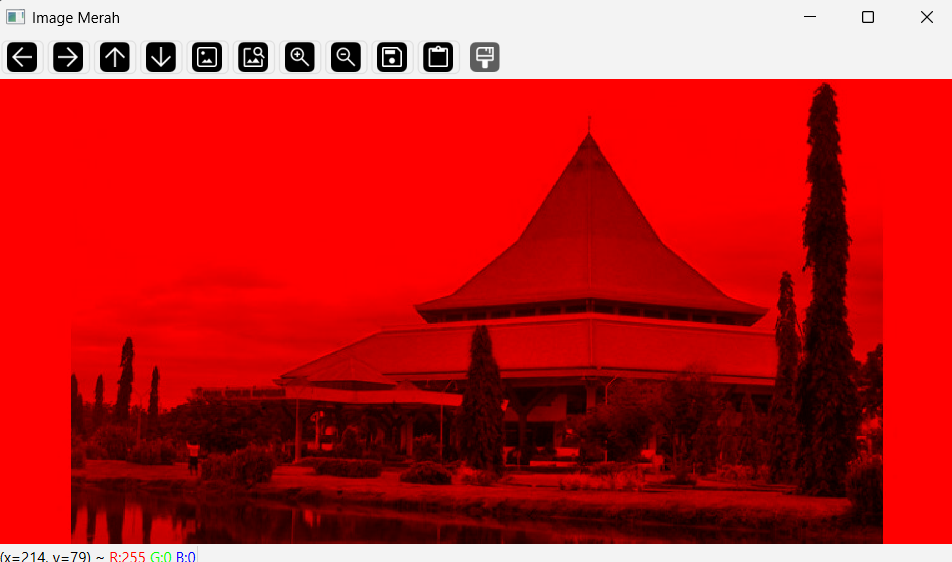
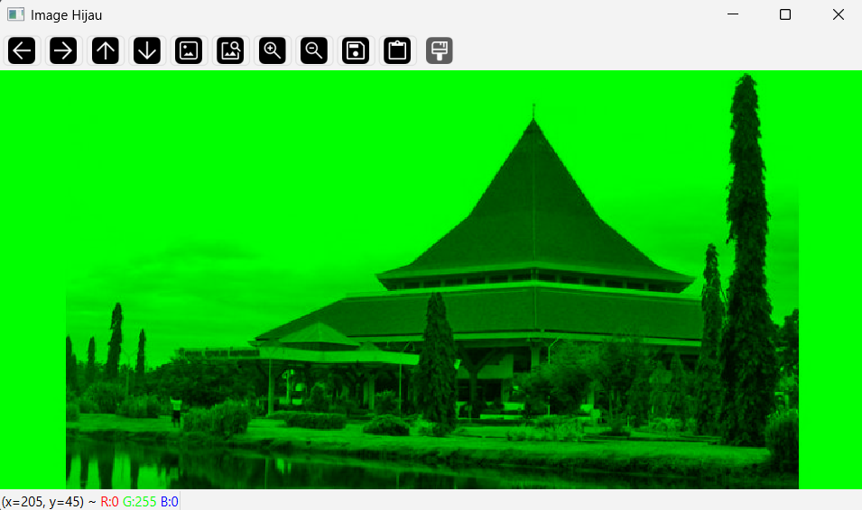 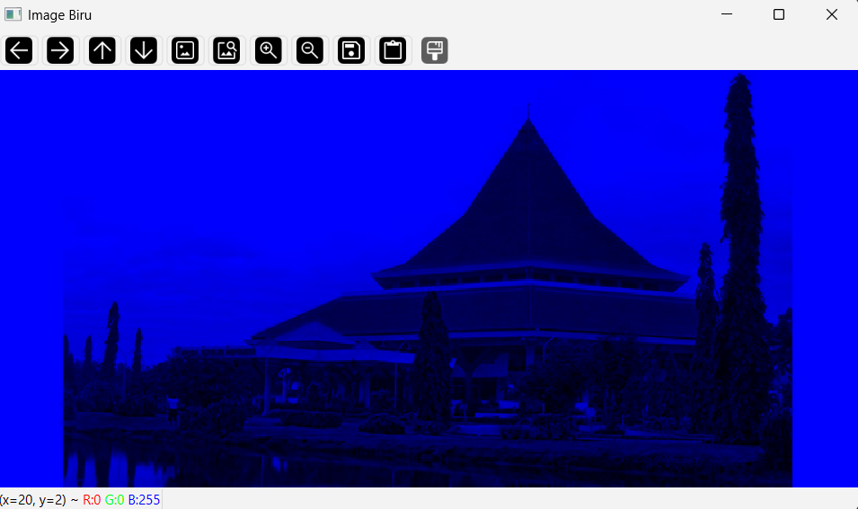

**Video Demo:**
<br>
<video src="https://github.com/user-attachments/assets/98ff12e5-6c00-4c7f-b733-fabf4beaf2c4" autoplay loop muted playsinline></video>

### Live Code 2: Transformasi Intensitas dan Ekualisasi
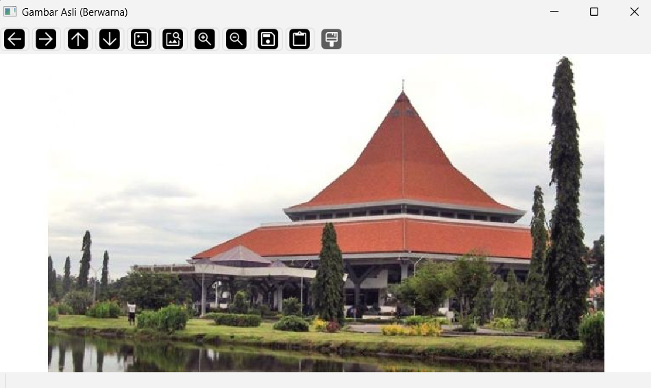 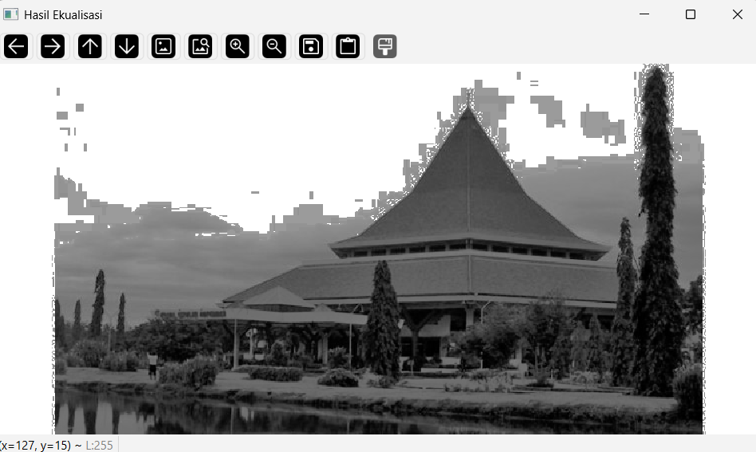
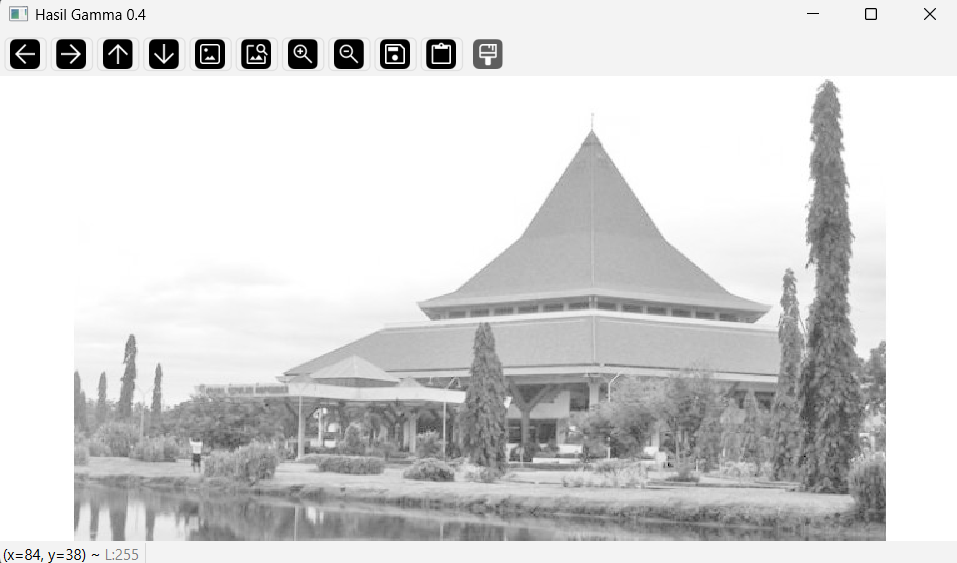 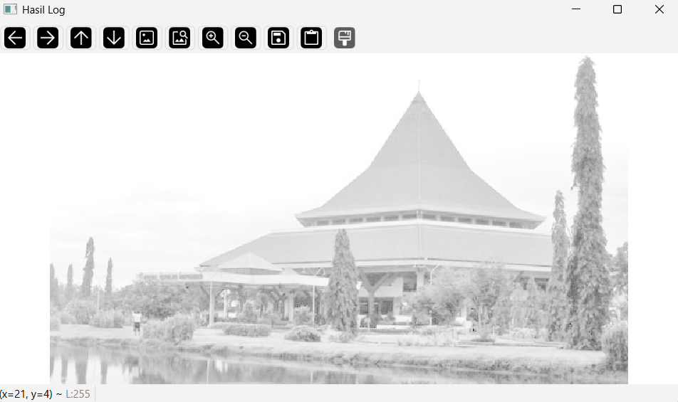
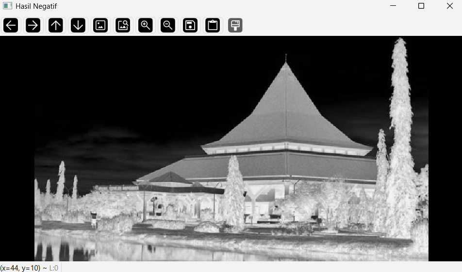

### Live Code 3: Filter Spasial
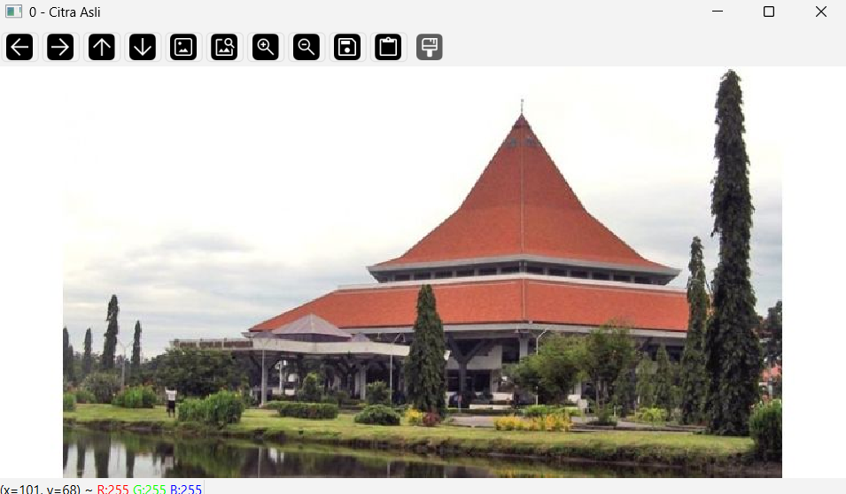 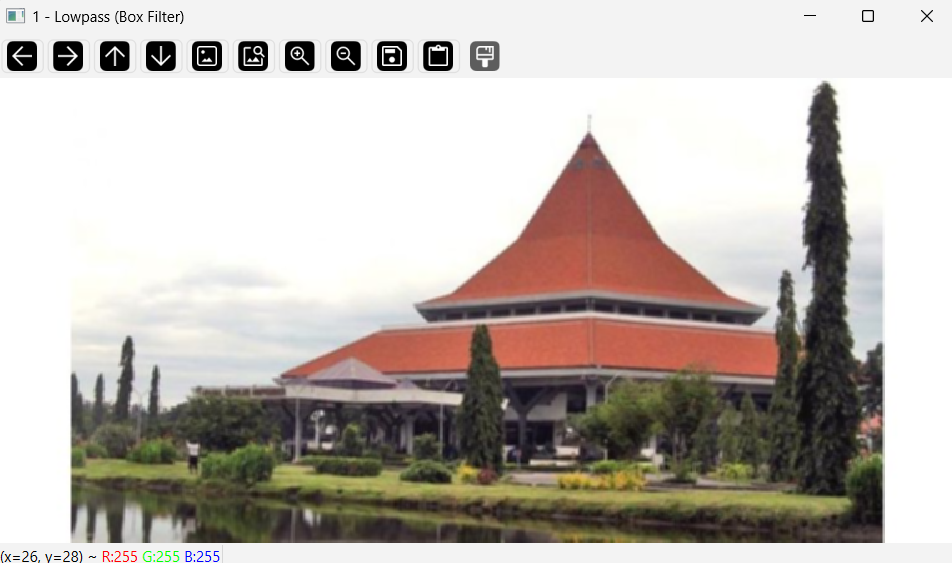
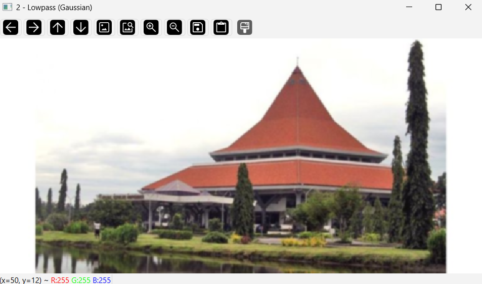 
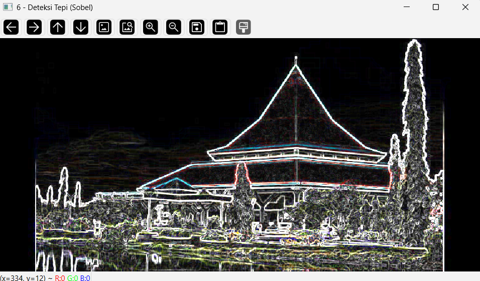 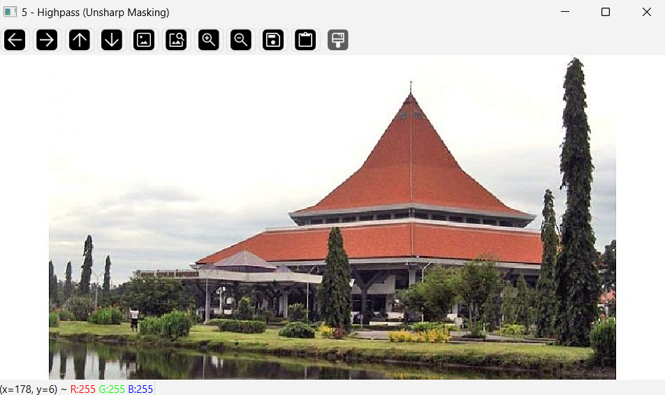

---

## Cara Menjalankan Program

1. Lakukan instalasi library yang dibutuhkan dengan menjalankan perintah:
   ```bash
   pip install opencv-python numpy matplotlib
